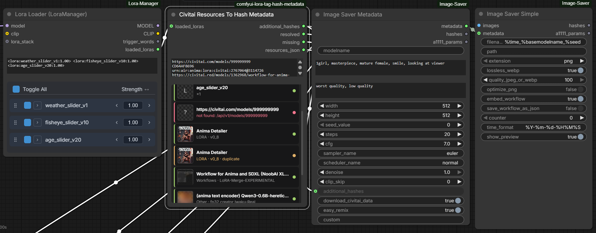

# ComfyUI LoRA Tag Hash Metadata

ComfyUI custom nodes that credit your generation resources on CivitAI by
embedding `Name:AUTOV2[:Weight]` hash metadata into saved images.

- **Civitai Resources To Hash Metadata** (v2, primary) — credits local lora
  tags AND any CivitAI resource (workflows, text encoders, detailers, …) from
  pasted URLs, hashes, or AIR URNs, with an in-node status list.
- **LoRA Tags To Hash Metadata** (v1) — converts `<lora:name:weight>` text
  into `Name:HASH:Weight` strings. Still supported.

Created with [comfyui-custom-node-template](https://github.com/PBandDev/comfyui-custom-node-template)

## Install

### ComfyUI Manager

1. Open **Manager** in ComfyUI
2. Click **Install Custom Nodes**
3. Search for `LoRA Tag Hash Metadata` or `comfyui-lora-tag-hash-metadata`
4. Click **Install**
5. Restart ComfyUI if Manager prompts you to do so

If you use the ComfyUI CLI instead of the Manager UI:

```bash
comfy node install comfyui-lora-tag-hash-metadata
```

## Civitai Resources To Hash Metadata (v2)

- Node id: `CivitaiResourcesToHashMetadata`
- Display name: `Civitai Resources To Hash Metadata`
- Category: `utils/metadata`

CivitAI auto-links image resources purely by file hash — including resource
types it can't detect from prompts, like whole workflows, text encoders
("Other"), and selectively-applied detailer LoRAs. This node resolves each
resource you list to its AutoV2 hash via the CivitAI API and emits it into
`additional_hashes` so uploads credit the creators automatically.



Typical wiring:

```text
Lora Loader (LoraManager).loaded_loras
  -> Civitai Resources To Hash Metadata.loaded_loras
  -> Image Saver Metadata.additional_hashes
```

Example `civitai_resources` input:

```text
# workflows, text encoders, detailers — anything on civitai
https://civitai.red/models/1362968/workflow-for-anima-and-sdxl-noobai-xlillustrious-xl
https://civitai.red/models/2598886/anima-text-encoder-qwen3-06b-heretic-abliterated-uncensored
https://civitai.com/models/2767064/anima-detailer?modelVersionId=3114726 0.8
CD64AF8696
urn:air:anima:lora:civitai:2767064@3114726
```

### ＋ Add Resource picker

The node's **＋ Add Resource** button opens a searchable picker so you never
have to hand-copy URLs:

- **CivitAI search** tab: live search (all content types, no filtering),
  type chips, sort, load-more; picking a result appends a version-pinned URL
  line to the textbox. Lora-ish results take an optional weight.
- **Local · LoRA Manager** tab (shown only when
  [LoRA Manager](https://github.com/willmiao/ComfyUI-Lora-Manager) is
  installed): pick from your local loras — matched files insert their civitai
  link, unmatched files insert their AutoV2 hash.
- Entries already in the textbox show **Remove** instead of Add, so the picker
  can also clean up. The textbox stays fully hand-editable either way.
- Result names link to their civitai page; lora-ish results take an optional
  weight (the small `wt` box).
- When a query returns nothing: civitai's public API hides some models
  (e.g. flagged ones) — the picker links the same search on the civitai site.
  Pasting such a model's version-pinned URL into the textbox still credits it.

The in-node status list updates **live**: picker applies, the per-row **✕**
(removes that line from the textbox), and the **⟳ Refresh resources** button
(under ＋ Add Resource) all re-parse `civitai_resources` through the node's
own resolver + cache — no queueing needed. `loaded_loras` is included live:
the preview reads the linked loader's widget state (LoRA Manager's loras
panel — honoring per-lora enable toggles, exactly like a run — or any node
exposing `<lora:…>` tag text), falling back to the last run's rows for
producers it can't read. Preview renders carry a "queue a prompt to
see final resource list" note. Loading a saved workflow re-renders the list
the same way. Hover a row (or its status dot) for what the color means —
resolved / unverified hash / duplicate / not credited.

Inputs:

- `loaded_loras` (optional link): `<lora:name:weight>` text, e.g. from LoRA
  Manager — handled exactly like v1
- `civitai_resources` (multiline textbox), one resource per line:
  - model URLs on any civitai domain (`.com`/`.red`/`.green`), optionally
    pinned with `?modelVersionId=…` — unpinned URLs resolve to the model's
    latest version
  - AutoV2 hashes (10 hex) or full SHA256 hashes (64 hex)
  - AIR URNs like `urn:air:anima:lora:civitai:2767064@3114726` (`+fileId`
    honored)
  - optional trailing weight: `<line> 0.8`
  - `#` comment lines and blanks are ignored
  - bare numeric IDs are rejected (ambiguous)

Outputs:

- `additional_hashes`: comma-separated `Name:AUTOV2[:Weight]` entries
  (weight only when explicit; lora tags keep their weights)
- `resolved` / `missing`: comma-separated names for quick display
- `resources_json`: structured JSON of every entry (status, type, version,
  hash, links) for downstream tooling

Behavior:

- in-node status list after each run: card rows with a preview thumbnail
  (civitai preview for URL/hash/AIR entries, local sidecar preview via
  ComfyUI's stock model-preview route for loras), name linked to civitai,
  type · version subline, and a status accent (green resolved / amber
  duplicate / red failed with reason)
- the list is capped at ~320px and scrolls inside the node — it never
  overflows the node bounds
- executes standalone (output node) — no downstream saver needed to check
  your list
- persistent on-disk cache under ComfyUI's user directory: version- and
  hash-pinned lookups cache forever, unpinned model URLs refresh after 24h;
  cached entries keep working offline
- failures never abort the queue — bad lines land in `missing` and the
  status list
- names are sanitized for Image Saver (`,`/`:` stripped, never literally
  `vae`), and all-decimal hashes get an explicit `:1.0` so the hash can't be
  misparsed as a weight

> **Image Saver footgun:** `Name:HASH:Weight` (3-part) entries are only
> parsed when Image Saver Metadata's `download_civitai_data` is **True**.
> With it False, 3-part entries are silently dropped — this affects all v1
> output (always weighted) and weighted v2 entries. Keep
> `download_civitai_data=True` (the default).

## LoRA Tags To Hash Metadata (v1)

- Node id: `LoraTagsToHashMetadata`
- Display name: `LoRA Tags To Hash Metadata`
- Category: `utils/metadata`

Inputs:

- `loaded_loras`: multiline string containing one or more `<lora:name:weight>`
  tags; LoRA Manager's dual-strength form `<lora:name:model:clip>` is accepted
  too (the model strength is the credited weight)

Outputs:

- `additional_hashes`: comma-separated `Name:HASH:Weight` string
- `resolved_loras`: comma-separated list of successfully resolved LoRA names
- `missing_loras`: comma-separated list of unresolved or incompatible names

Behavior:

- supports `<lora:name>` and defaults weight to `1.0`
- resolves path-qualified names before basename fallback
- treats dotted version suffixes such as `my_lora_v0.23` as part of the LoRA name unless a known model extension is present
- computes SHA256 locally and emits the first 10 uppercase hex characters
- deduplicates repeated tags with last occurrence winning
- reports comma-bearing names in `missing_loras` instead of silently dropping them

## Local Development

1. Clone/symlink this folder into ComfyUI's `custom_nodes/` directory
2. Run `pnpm install`
3. Run `pnpm dev` to watch for changes and rebuild `dist/`

```bash
pnpm install    # Install dependencies
pnpm dev        # Watch mode - rebuilds dist/ on change
pnpm build      # Build for production
pnpm test       # EVERYTHING: vitest + pytest + full e2e (live civitai API)
```

**Note:** Reload ComfyUI frontend (browser refresh) for JS changes. Restart ComfyUI server for Python changes.

### Testing

One suite, no tiers: `pnpm test` runs frontend unit tests, backend Python
tests, and a full end-to-end run against a repo-local pinned ComfyUI (with
LoRA Manager + Image Saver + real fixture loras + the live civitai API) —
every time, locally and in CI. See [docs/TESTING.md](docs/TESTING.md) for the
harness details, manual serve mode (`pnpm e2e:serve`), and user stories.

```bash
uv sync                 # python deps
pnpm test:unit          # fast lanes only
pnpm test:e2e           # provision .e2e/ + playwright
```

## Publishing to ComfyUI Registry

1. Ensure all fields in `pyproject.toml` are correct
2. Add `REGISTRY_ACCESS_TOKEN` secret to your repo (from ComfyUI registry)
3. Go to Actions → "Publish to Comfy registry" → Run workflow
4. Select version bump type (patch/minor/major)

## License

MIT
